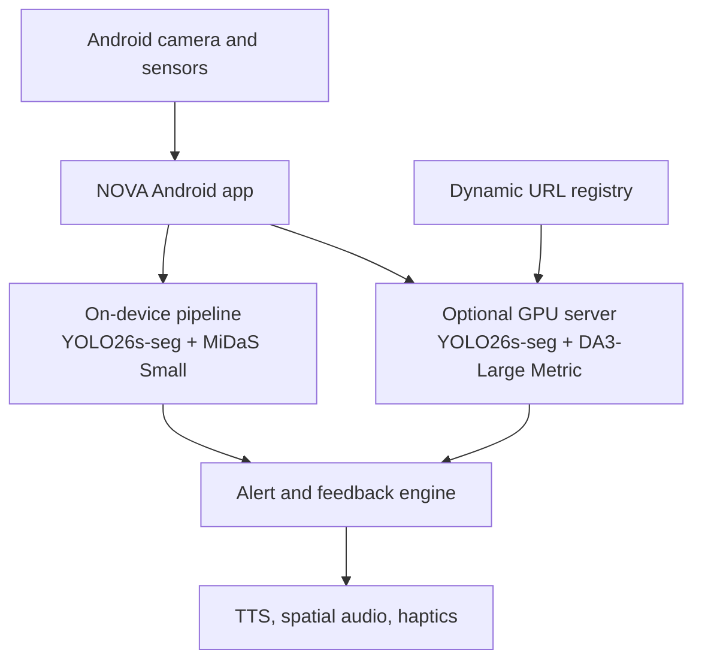

# NOVA — Navigation and Object Vision Assistant

> A privacy-first, real-time Android navigation assistant for visually impaired people. NOVA detects nearby obstacles, estimates their distance, and communicates safe, actionable guidance through voice, sound, and haptic feedback.


## About

NOVA (Navigation and Object Vision Assistant) is a BS Data Science final-year project developed for assistive navigation in university-campus and indoor environments. It turns a mid-range Android phone into an obstacle-awareness companion without requiring dedicated wearable hardware or a permanent internet connection.

The app is designed around an offline-first hybrid architecture. It always has an on-device inference path and can optionally connect to a GPU server for stronger detection and metric depth estimation. If the server is unavailable, NOVA automatically continues with local processing.

## Key Features

- **Real-time obstacle detection and instance segmentation** using a custom YOLO26s-seg model.
- **15 active navigation-relevant classes** including stairs, potholes, speed-breakers, ramps, people, vehicles, doors, chairs, tables, and benches.
- **Offline-first operation** with local Android inference and automatic fallback when the GPU server cannot be reached.
- **Distance-aware alerts** using on-device MiDaS Small relative depth with runtime calibration, or server-side DA3-Large metric depth when available.
- **Unknown-obstacle detection** that scans the walking corridor for depth anomalies beyond the trained classes.
- **Free-path guidance** that estimates a safer direction through the scene.
- **Five-tier alert prioritization** to prevent alert overload while allowing immediate hazards to bypass non-critical suppression.
- **Multi-modal feedback:** text-to-speech, directional/stereo audio cues, earcons, and vibration patterns.
- **Voice control** with 26 commands, using coverage-weighted Jaro-Winkler matching to tolerate speech-recognition errors and reduce accidental triggers from ambient speech.
- **Object finder** powered by Grounding DINO for open-vocabulary queries.
- **Room scanning and spatial memory** backed by Room SQLite, Wi-Fi fingerprints, and compass heading.
- **Emergency and accessibility utilities** including an SOS path, OCR/text-reading support, and a foreground navigation service.

## System Architecture



### On-device pipeline

1. Captures and preprocesses camera frames.
2. Runs YOLO26s-seg obstacle detection and MiDaS Small depth estimation in parallel.
3. Refines per-object depth with instance-segmentation masks.
4. Applies temporal tracking, EMA smoothing, unknown-obstacle scanning, and free-path calculation.
5. Ranks and suppresses alerts according to urgency.
6. Delivers concise spoken, audio, and haptic feedback.

### Optional GPU pipeline

The server uses FastAPI and WebSockets to receive frames and return structured detections and alerts. It runs the custom YOLO26s-seg model with **DA3-Large Metric** depth estimation for higher-quality, metre-based distance readings. A dynamic URL registry lets the Android app discover the current temporary GPU endpoint without hard-coding it.

## Model and Evaluation

| Item | Result |
|---|---|
| Detection model | YOLO26s-seg (Run6-alt) |
| Training data | 142,000+ annotated images |
| Active production taxonomy | 15 obstacle classes |
| Reported detection accuracy | **mAP50: 0.774** |
| On-device depth model | MiDaS Small (relative depth with EMA calibration) |
| Server depth model | Depth Anything 3 Large Metric |
| Voice commands | 26 supported commands |

The active taxonomy is intentionally focused on the classes most useful for campus and indoor navigation. Three trained classes—bicycle, truck, and curb—are disabled in production due to unreliable field performance or excessive false positives.

## Technology Stack

| Layer | Technologies |
|---|---|
| Android application | Kotlin, Jetpack Compose, CameraX, TensorFlow Lite, Room SQLite |
| On-device AI | YOLO26s-seg TFLite, MiDaS Small TFLite |
| GPU inference server | Python, FastAPI, WebSockets, PyTorch, Ultralytics |
| Server AI | YOLO26s-seg, Depth Anything 3 Large Metric, Grounding DINO |
| Feedback and sensing | Android TTS, SpeechRecognizer, vibration, GPS, Wi-Fi fingerprinting, motion sensors |
| GPU workflow | Google Colab T4 with a dynamic Railway URL registry |

## Repository Structure

```text
.
├── App/
│   └── main/
│       ├── assets/                         # TFLite detection and depth models
│       ├── java/com/nova/assistant/
│       │   ├── engine/                     # Inference pipeline and temporal filtering
│       │   ├── features/                   # Navigation, room scan, voice-command logic
│       │   ├── feedback/                   # TTS, audio, and haptic orchestration
│       │   ├── ml/                         # YOLO, depth, camera-frame analysis
│       │   ├── server/                     # GPU-server client and result models
│       │   └── ui/                         # Compose screens
│       └── AndroidManifest.xml
└── Server/
    ├── Colab Notebook.ipynb                # GPU-server notebook workflow
    ├── nova_server.py                      # FastAPI/WebSocket inference service
    ├── depth_utils.py                      # Server-side depth utilities
    └── alert_logic.py                      # Alert ranking and construction
```

## Running the Project

### Android application

The repository contains the Android application source and model assets under `App/main`. Import or copy this source into an Android Studio project configured with the required Android/Compose, CameraX, TensorFlow Lite, and Room dependencies. Grant the app's required runtime permissions, particularly camera, microphone, location, and notifications/vibration where applicable.

> The Gradle wrapper and root build configuration are not currently included in this repository, so a direct clone is not yet a complete Android Studio build.

### Optional GPU server

The GPU path is optional; NOVA remains usable through its local fallback pipeline.

1. Open `Server/Colab Notebook.ipynb` in Google Colab with a GPU runtime.
2. Provide the trained `.pt` weights and set `NOVA_MODEL_PATH` if they are not placed at the default location expected by `nova_server.py`.
3. Start the FastAPI/WebSocket server from the notebook workflow.
4. Register its current secure WebSocket endpoint with the URL registry configured in `NovaConstants`.
5. Start navigation from the Android app. It will use the server when available and fall back locally if the connection fails.

## Safety and Privacy

NOVA is an academic prototype intended to complement—not replace—a white cane, trained mobility instruction, situational awareness, or other established navigation aids. It must not be relied upon as the sole safety mechanism.

Camera processing is local by default. The optional GPU mode sends frames to the user-configured inference server, so it should only be enabled on a trusted connection and server.

## Current Limitations

- The server-tier distance estimates are more accurate than the calibrated, relative on-device depth estimates.
- Performance and thermal behavior can vary across Android chipsets.
- The current evaluation is based on developer field testing and four physical devices; a structured usability study with visually impaired users remains future work.
- TalkBack coexistence and longer real-world trials need further validation.

## Future Improvements

- Deploy a lighter metric-depth model directly on-device.
- Expand field testing across more Android devices and environments.
- Improve weaker detection classes through additional training data and retraining.
- Conduct a dedicated accessibility and usability study with visually impaired participants.
- Add a complete reproducible Android build configuration, release workflow, and dependency documentation.

## Academic Context

This project was developed as a final-year project for the **BS Data Science** program at the **University of Engineering and Technology (UET), Peshawar**.

---

If you find this project useful, please consider giving the repository a star.
